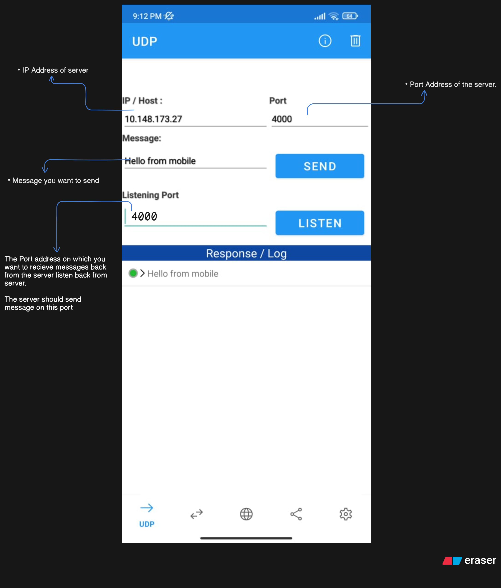

## 📡 Creating UDP Server in Node.js

### 🔹 Step 1: Import dgram Module

In Node.js, the `dgram` module is used for UDP. And this dgram returns an emitter

```javascript
import dgram from 'node:dgram';
const socket = dgram.createSocket('udp4'); // "udp4" for IPv4
```

### 🔹 Step 2: Listening for Messages (UDP Server)

Whenever any device sends a message, the `message` event will be triggered.

```javascript
socket.on('message', (message, remoteAddress) => {
  console.log('Message as buffer ', message);
  console.log(message.toString());
  console.log(remoteAddress);
});
```

- **message** → actual message (Buffer format)
- **remoteAddress** → info about sender (IP address, port, size, etc.)

### 🔹 Step 3: Binding Server to a Port

It is necessary to bind the UDP server to a port (if you are creating a server).

```javascript
socket.bind({ port: 4000 }, () => {
  console.log('Server listening on', socket.address());
});
```

⚠️ This is not directly accessible in the browser because browsers do not understand UDP.

### 🔹 Step 4: Sending Message (UDP Client)

If you do not want to create a server and want to send a message to another device → use `socket.send()`.

```javascript
socket.send('Hi from Lappy', 3000, '192.168.1.3');
```

- **"Hi from Lappy"** → message
- **3000** → mobile app server port
- **"192.168.1.3"** → mobile's IP (in local network)

---

### 🔹 Working Example (Scenario)

1. **Client code** is running on your **Laptop**.
2. A **UDP Server app** is running on your **Phone** (on port 3000).
3. When the message is sent from the laptop →
   `Message Received from 192.168.1.9:34688 < "Hi from Lappy"`
   → This appeared on the phone's app.

---

### ✅ Summary:

- If you want to create a **server** → use `bind()`.
- If you want to **send a message** to another device → use `send()`.
- UDP is a **connectionless protocol** → you only need to send the message; no connection needs to be established.

---

### Proper Working Examples:

- **Server:**

```javascript
import dgram from 'node:dgram'; //UDP

const socket = dgram.createSocket('udp4');
socket.on('message', (message, remoteAddress) => {
  console.log(message.toString());
  console.log(remoteAddress);

  //send acknowledgement back to sender
  socket.send(
    'Message Recieved successfully on server',
    remoteAddress.port,
    remoteAddress.address,
  );
});

socket.bind({ port: 4000 }, () => {
  console.log(socket.address());
  const address = socket.address();
  console.log(`Listening on port ${address.port}`);
});
```

- **Explanation:**

        -> When a client sends a message on port 4000 the message event gets triggered.
        -> The server sends the acknowledgement back to client on the same port and address of the client.

- **Client:**

```javascript
import dgram from 'node:dgram'; //UDP

const socket = dgram.createSocket('udp4');

//To recieve the acknowledgement message from the server, otherwise we dont need this.
socket.on('message', (message, remoteAddress) => {
  console.log(message.toString());
  console.log(remoteAddress);
  socket.close();
});

socket.send('Hello from Client.js', 4000, '10.148.173.27');
```

### We can do the same on mobile phone using UDP app.


