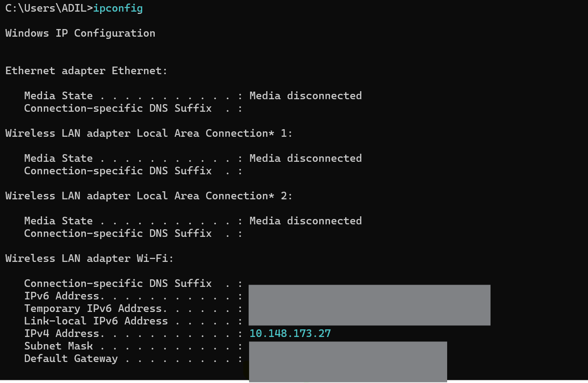

## Creating Our Own LAN & Localhost Server

### 🖧 LAN Setup Example

`Situation`: Hamare paas 3 devices hain: 👉 Laptop, iPad, aur Phone – jo ek router se connected hain (Wi-Fi ya cable se).

`🔹 Router kya hota hai?`

    Router ek chhoti computer machine jaisa hota hai jisme CPU, memory etc. hoti hai,
    aur yeh sabhi devices ko IP address assign karta hai.

### 🔍 Check Your IP Address (Linux/Windows)

`Command:`

    ipconfig   (For windows)

    ip a  (For linux)

👉 Yeh command tumhare device ka local IP address dikhata hai jo router ne assign kiya hai.

### 📍 Router's IP / Default Gateway

`Default Gateway (only router)` Agar tum is address ko browser mein daalte ho (e.g., 192.168.1.1), to router ka admin page khul sakta hai jisme details jaise:

- Router model
- Connected devices
- MAC addresses
- Network settings
- ...dekhne ko milti hain.

### 🧠 IP Address Format in LAN

Router jitne bhi devices ko connect karta hai, un sab ko similar IP deta hai:

- Laptop 192.168.1.9
- Phone 192.168.1.2
- iPad 192.168.1.3

➡️ Yeh sab IPs ek hi subnet me hain (192.168.1.X), bas last digit alag hoti hai.

---

## 🖥️ Making Your Laptop a Local Server

1. `Step 1:`
   Tum VS Code me kisi b folder (jis k contents access krne ho) ma ja k ek index.html file banao aur usme kuch content likho.
2. `Step 2:`
   Use Live Server Extension se run karo.

By default, yeh server start hoga:

    http://127.0.0.1:5500/index.html

`📌 Note:`

    127.0.0.1 is a loopback IP, jise hum localhost bhi kehte hain.

localhost ka matlab hota hai — "meri machine khud".

✅ So yeh bhi chalega:

    http://localhost:5500/index.html    (both are same)

### 🌍 Accessing from Other LAN Devices

Ab tumhare dusre LAN-connected devices (Phone, iPad) agar same Wi-Fi pe hain, to wo bhi tumhare server ko access kar sakte hain:

➡️ Use this URL in browser:

    10.148.173.27:5500

- 📌 Yahan `10.148.173.27` tumhare laptop ka IP hai.

✅ Ab un devices me bhi same website open ho jaayegi — bina internet ke, sirf LAN par!

### 🔚 Summary

**_Step: What Happens_**

- 1️⃣ Devices connect to router (get IPs like 192.168.1.X)
- 2️⃣ Laptop becomes server using Live Server
- 3️⃣ Access site on other devices via laptop’s IP
