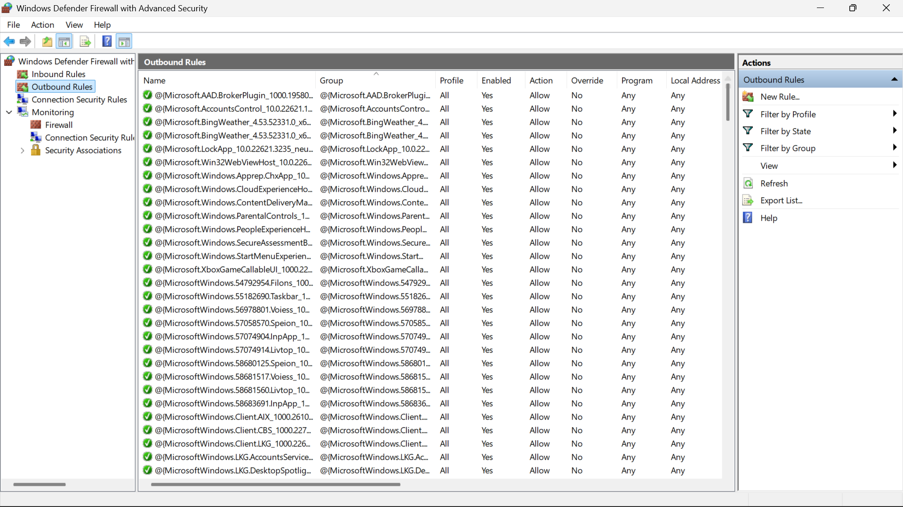
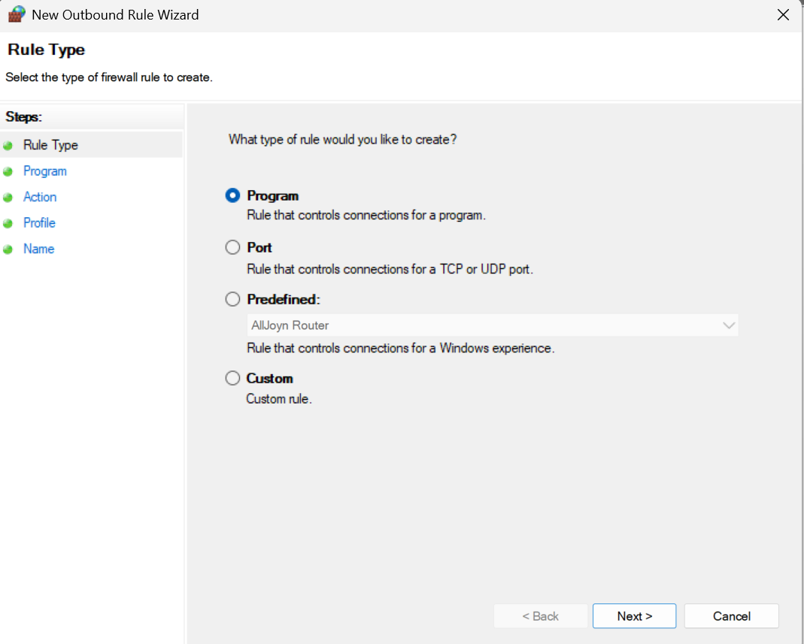
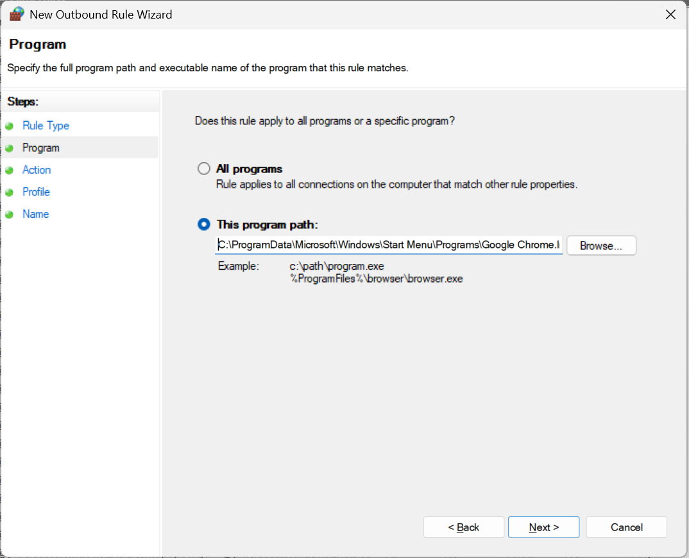
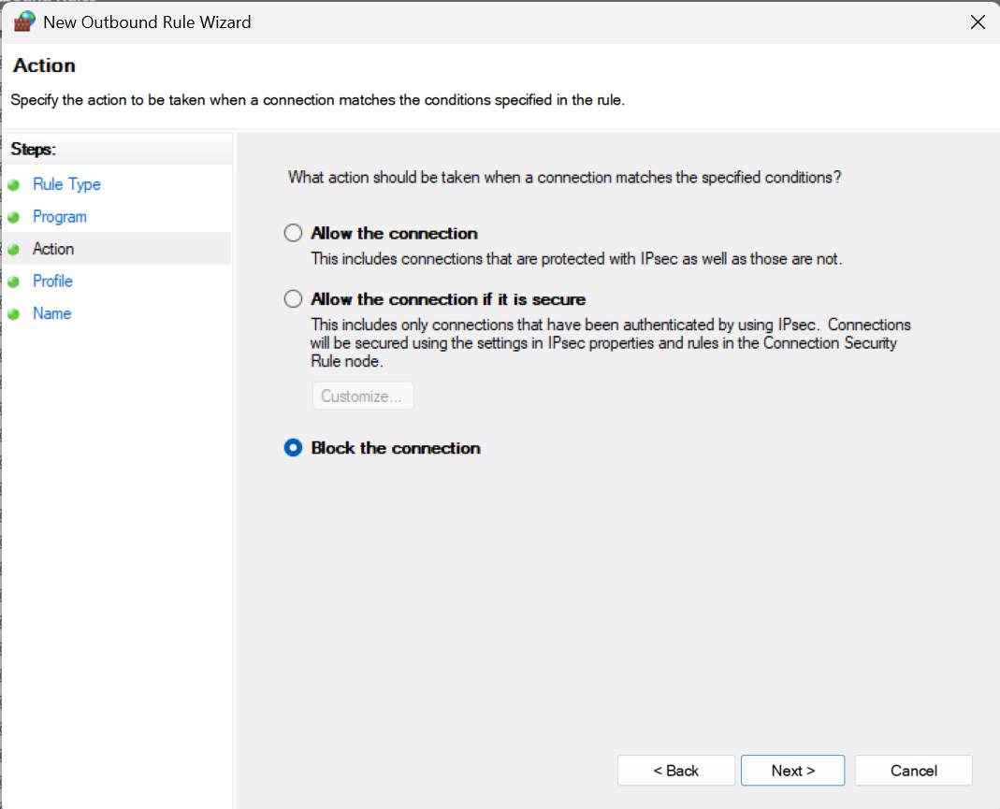

## What are firewall ?

    A firewall is a network security system that monitors and controls incoming (inbound) and
    outgoing (outbound) traffic based on rules.

## 1. Why Do We Use Firewalls?

| Purpose                        | Explanation                                                   |
| ------------------------------ | ------------------------------------------------------------- |
| 🚫 Block Unauthorized Access   | Protect devices/networks from hackers or malware              |
| 🧠 Allow Only Specific Traffic | E.g., allow HTTP (port 80) but block SSH (port 22)            |
| 🧪 Prevent Misuse              | Block dangerous apps, trojans, port scans                     |
| 🌐 Network Isolation           | Separate trusted and untrusted zones (e.g., office vs guests) |

---

## 2. Types of Firewalls

| Type                      | Description                                                       |
| ------------------------- | ----------------------------------------------------------------- |
| 🧑‍💻 Software Firewall      | Installed on OS (e.g., Windows Defender Firewall, UFW on Linux)   |
| 📦 Hardware Firewall      | Physical device (e.g., enterprise routers with built-in firewall) |
| 🌐 Cloud/Network Firewall | Hosted on cloud services (e.g., AWS, Azure, Cloudflare)           |

---

## 3. How a Firewall Works (Simple Flow)

```
[ Internet ]
     ↓
 [ Firewall ]
     ↓
[ Your Device ]
```

Every incoming and outgoing packet is checked against the firewall rules.

---

## 4. What Can Be Blocked or Allowed?

- **IP Address** – Block/allow specific IPs.
- **Port Number** – E.g., allow port 3000, block port 21.
- **Protocol** – Allow TCP, block UDP.
- **Application** – Block specific apps (e.g., telnet.exe).
- **MAC Address** – Control devices in a LAN (if supported).

---

## 5. Types of Network Profiles

| Profile         | Usage                            | Security Level          |
| --------------- | -------------------------------- | ----------------------- |
| Public Network  | For public places (coffee shops) | Strict rules            |
| Private Network | Trusted networks (home Wi-Fi)    | Moderate rules          |
| Domain Network  | Enterprise/office networks       | Managed by organization |

---

## 6. Inbound vs Outbound Rules

| Type     | Default Behavior | Purpose                                     |
| -------- | ---------------- | ------------------------------------------- |
| Inbound  | Mostly blocked   | Controls traffic coming **in** from outside |
| Outbound | Mostly allowed   | Controls traffic going **out** from inside  |

Rules can allow or block specific ports, apps, or IPs.

---

## 7. DPI (Deep Packet Inspection)

- Advanced firewall feature.
- Inspects contents of packets (not just headers).
- Detects and blocks malicious or unauthorized content.

---

## 8. How to Block/Allow Using Windows Firewall (Step-by-Step)

### **Block Inbound/Outbound Traffic for an App**

1. Open **Control Panel → Windows Defender Firewall**.
2. Click **Advanced Settings**.
3. Choose **Inbound Rules** or **Outbound Rules**.
4. Click **New Rule…**.
5. Select **Program** → Browse to the app’s `.exe` file.
6. Choose **Block the Connection** or **Allow the Connection**.
7. Select profiles (Domain, Private, Public).
8. Name the rule → Finish.

### **Block/Allow Specific Port**

1. Go to **Advanced Settings**.
2. Choose **Inbound/Outbound Rules** → **New Rule…**.
3. Select **Port**.
4. Enter port number (e.g., 3000).
5. Select **Allow** or **Block**.
6. Apply to desired profiles.
7. Name the rule → Finish.





