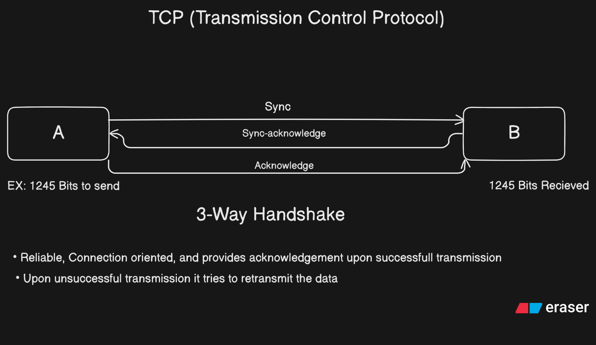

# TCP and UDP: The Backbone of the Internet

In this section, we discuss two of the most important protocols that form the backbone of the internet: **TCP** and **UDP**. Most other protocols are built on top of these two.

---

## What are TCP and UDP?

- **TCP (Transmission Control Protocol)** and **UDP (User Datagram Protocol)** are both Layer 4 (L4) protocols in the OSI model.
- Almost all internet protocols (except IP), such as HTTP, FTP, SMTP, and WebRTC, are based on TCP or UDP.
- TCP is used more frequently because it provides reliable data transfer.

---

## How TCP Works

- **TCP** is designed to transfer data efficiently and reliably from one point to another.
- It uses a process called the **3-way handshake** to establish a connection:
  1. **SYN**: Computer A sends a SYN (synchronize) message to Computer B.
  2. **SYN-ACK**: Computer B responds with a SYN-ACK (synchronize-acknowledge).
  3. **ACK**: Computer A sends an ACK (acknowledge) back to Computer B.
- After the handshake, a session is established, and data transfer begins.
- Large data is broken into smaller segments for transfer.
- TCP ensures that all data is received correctly. If any data is lost, it is resent.
- Both devices must follow the TCP protocol rules, regardless of their operating system (Windows, Mac, Android, etc.).
- In Node.js and most programming environments, TCP is implemented behind the scenes; developers just use it.


---

## How UDP Works

- **UDP** is used when reliability is not as important as speed.
- It is called "unreliable" because it does not guarantee data delivery.
- UDP is useful for real-time applications like video calls, where speed is more important than perfect accuracy.
- Data is sent in small pieces called **datagrams**.
- UDP does not check if the data reaches the destination; it just sends it to the given address.
- If some data is lost, the application (or user) must handle it (e.g., asking someone to repeat themselves in a call).
- UDP is mainly used for speed and low-latency communication.

---

## Real-World Examples

- **TCP**: Used for applications where data integrity is critical, such as file transfers, web browsing (HTTP/HTTPS), and emails.
- **UDP**: Used for applications where speed is more important, such as live video/audio streaming, online gaming, and video calls (WebRTC).

---

## Newer Protocols

- **QUIC (Quick UDP Internet Connection)**: Developed by Google, QUIC is based on UDP and is used in HTTP/3.
- **HTTP/3**: The latest version of HTTP, built on top of QUIC (and therefore UDP).

---

## Protocol Layer Structure

```
        IP
      /    \
   TCP     UDP
             \
            QUIC
             |
          HTTP/3
```

- HTTP/1 and HTTP/2 are built directly on TCP.
- HTTP/3 is built on QUIC, which uses UDP.

---

## Ports in TCP and UDP

- Both TCP and UDP have **2^16 (65,536) ports**.
- Applications using TCP and UDP can run on the same port number without conflict because they are separate protocols.
- However, two TCP applications cannot use the same port at the same time.

---

## Summary

- **TCP** is reliable, connection-oriented, and used for most internet applications.
- **UDP** is fast, connectionless, and used for real-time or streaming applications.
- Understanding when to use TCP or UDP is crucial for building efficient network applications.

---


